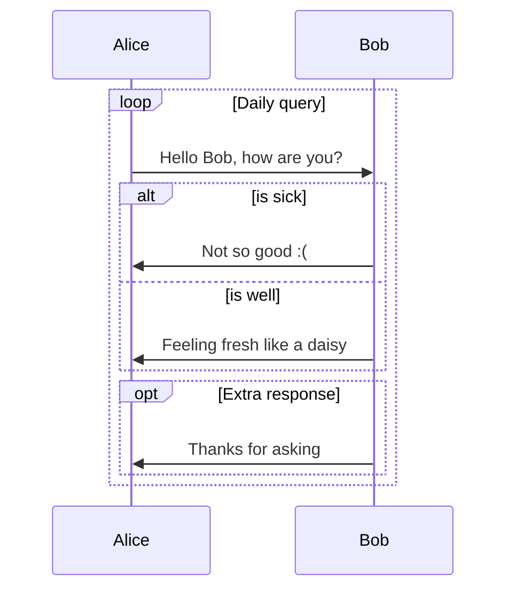

# 已经全面迁移到`shokax`，以下内容均不适用。


# 超链接下方的虚线显示

作者在自己的博客上做到了让超链接底部显示虚线，但发布的正式版里没有这个功能。

没有虚线的超链接默认只是粉色的字，鼠标放上去才会变成蓝色让你知道是个超链接，但这样并不直观，很多时候容易和`code`标签混淆。

至于为什么把这么小的改动放在文章的第一个改动，是因为这是我靠自己解决的第一个hexo问题，值得庆祝🎉。!!其中持续骚扰[imba97](imba97.cn)解答豆包回答不明白的问题!!

在主题文件夹下找到`\themes\shoka\source\_common\post\expand.styl`这个文件。
修改第28行开始的`a`标签的样式，直接复制下面的代码覆盖过去就好。

```
  a {
    color: var(--primary-color); //原始链接颜色
    border-bottom: 2px dashed #eff2f3;
    padding-bottom: 3px

    &:hover {
      color: var(--color-blue); //鼠标经过颜色
      border-bottom-color: #38a1db;
    }
```


# 修复主题`polyfill.js`失效问题

主题代码年久失修，其中`polyfill.js`的链接已经是很老的版本了，换成新链接就解决。

但你如果喜欢霸凌浏览器，可以直接把下面要修改的那部分删除。
他的主要作用是给中古版本浏览器补充不支持的最新 JavaScript 特性，让网站能在老版本IE、Chrome等浏览器中有和正常使用环境一样的使用体验。
!!支持霸凌老版本浏览器！!!

打开`\themes\shoka\layout\_partials\layout.njk`文件

修改第145行中配置的`polyfill.js`链接，直接复制代码覆盖原本的第145行即可。

```html
<script src="https://polyfill-fastly.io/v3/polyfill.min.js"></script>
```


# 修复`mermaid`流程图无法正常显示的问题

>原创为 [解决 hexo-shoka 主题的流程图 mermaid 不能正常显示问题](https://blog.liq2.com/article/ff29002e)

1. 打开`node_modules\hexo-renderer-multi-markdown-it\lib\renderer\markdown-it-mermaid`文件夹。
2. 修改文件夹中的`index.js`文件。
   把其中的`if (token.info === 'mermaid')`修改为`if (token.info === 'Mermaid')`
3. 修改的部分仅仅是把`mermaid`的`m`改为大写，修改完成后在typora等编辑器中写mermaid流程图时也要记得大写`M`

```
md.renderer.rules.fence = (tokens, idx, options, env, self) => {
        const token = tokens[idx]
        const code = token.content.trim()

        if (token.info === 'Mermaid') {
            var firstLine = code.split(/\n/)[0].trim()
            if (firstLine.match(/^graph (?:TB|BT|RL|LR|TD);?$/)) {
                firstLine = ' graph'
            } else {
                firstLine = ''
            }
            return mermaidChart(code, config, firstLine)
        }
        return defaultRenderer(tokens, idx, options, env, self)
    }
```

如下所示，在`M`为小写时文章内并不能正确显示流程图，只有为大写时才会正确显示。

~~~


这里代码块应该是和下面一样的流程图👆，但没有被正确显示。

```Mermaid
sequenceDiagram
    loop Daily query
        Alice->>Bob: Hello Bob, how are you?
        alt is sick
            Bob->>Alice: Not so good :(
        else is well
            Bob->>Alice: Feeling fresh like a daisy
        end

        opt Extra response
            Bob->>Alice: Thanks for asking
        end
    end
```
~~~

## 流程图演示


这里代码块应该是和下面一样的流程图👆，但没有被正确显示。


# 解决代码块无法正确显示大括号`{}`的问题

在给一些代码做代码高亮的时候，`{}`大括号会被错误的识别，造成这个代码块变成空白。
解决办法就是把`{`用`&#123;`代替，`}`用`&#125;`代替。


# 修改网站底部信息

主题作者没有写方便修改底部信息的功能，比如在`config.yml`里修改等。我不确定hexo能不能这样改，但就这么个意思。

如果想修改网站的底部信息，可以在`themes\shoka\layout\_partials\footer.njk`文件里直接点价相应的heml代码。